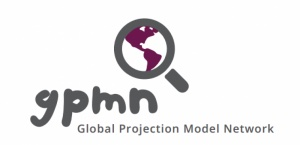

<a href="https://www.igpmn.org"></img></a>
The Global Economy Equilibrium Scenario Builder (GEESr) is a practical macroeconomic scenario analysis framework built
around a multi-area DSGE model. The framework is currently implemented in
[Matlab&trade;](https://www.mathworks.com) with the use of the
[Iris Toolbox](https://www.iris-toolbox.com).

GEESr is being developed and maitained by a [Global Projection Model Network](https://www.igpmn.org)
team of contributors:

??? quote "Jaromir Benes"

    Chief developer at GPMN

??? quote "Jaromir Hurnik" 

    Director of GPMN

??? quote "Daniela Milucka" 

    Chief economist at GPMN

??? quote "Victoria Petrenko" 

    Model developer at GPMN

