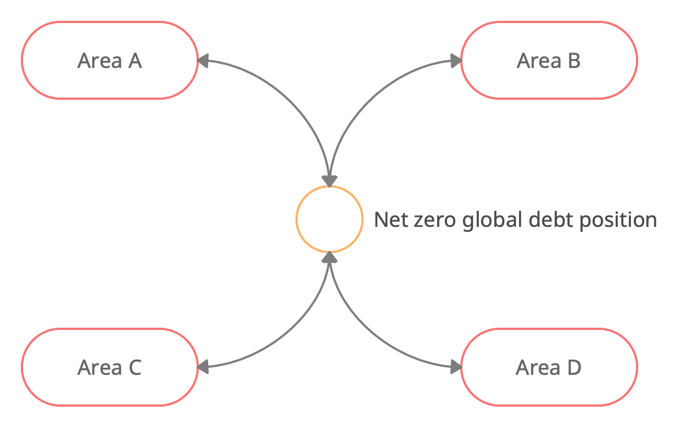
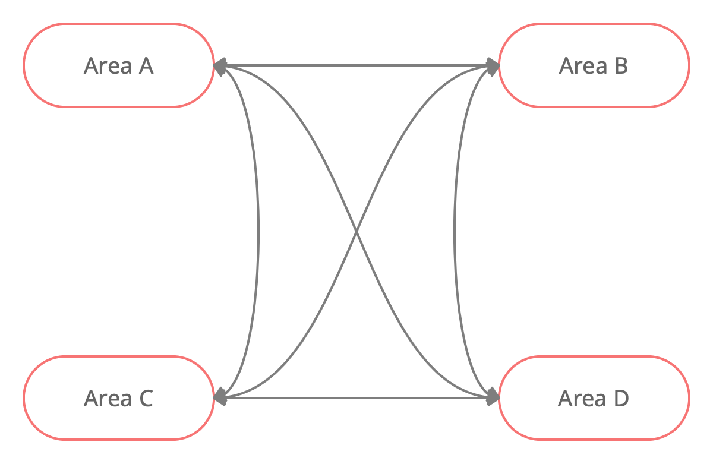

# :fontawesome-solid-diagram-project:  Flowcharts

## Goods and input factors within an area

* Two production sectors: local and exporting

* Commodity inputs

## Trade linkages

* Each area needs a specific composition of its imports

* The composition (aggregation) is price sensitive

* Bilateral trade relationships exist, can be e.g. subjected to area specific
  import tariffs

## Debt finance linkages

* Each ares can enter a positive or negative debt position with the rest of
  the world

* All area positions are cleared throgh a zero net supply assumption
  worldwide

* No bilateral debt relationships

## Equite finance linkages

* Each area's residents hold a fixed proportion of each other area's claims
  on production capital

* No price-elastic changes in demand for these claims exist

