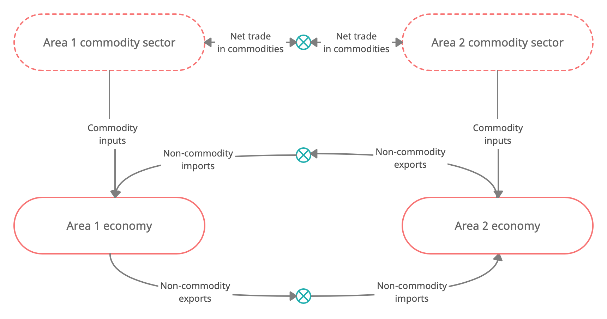

--8<-- "model/math.md"
![[model/math.md]]

## Symmetric two-area economy wrapper

 

 

## Determination of interest rates in the long run

* Example of a two-area setup

* Assume zero inflation in either area for simplicity (hence, nominal
  interest rates equal real interest rates)

* With zero inflation differentials and equal long-rung productivity growth
  (driven by the global productivi

* Initially, we turn off the net worth effect by setting $\nu_1=0$

###### Interest parity (international debt finance markets) in base rates

$$
r^\aa = r^\bb
$$

###### Effective household rate (local banking sector)

$$
\begin{gathered}
rh^\aa = r^\aa + f\left(\frac{\mathit{nfa}}{\mathit{ngdp}}\right) \\[5pt]
rh^\bb = r^\bb + f\left(\frac{\mathit{nfa}}{\mathit{ngdp}}\right)
\end{gathered}
$$

###### Euler equations (consumer choice)

$$
\begin{gathered}
rh^\aa = \frac{1}{\beta^\aa} \, \roc{a^\gg} \\[5pt]
rh^\bb = \frac{1}{\beta^\bb} \, \roc{a^\gg}
\end{gathered}
$$

* Effective real interest rates are determined by the discount factor,
  $\beta$, and real growth, $\roc{a}$.

* The space between the base rate and the effective rate is filled with a
  premium/spread determined by the NFA position in each area

